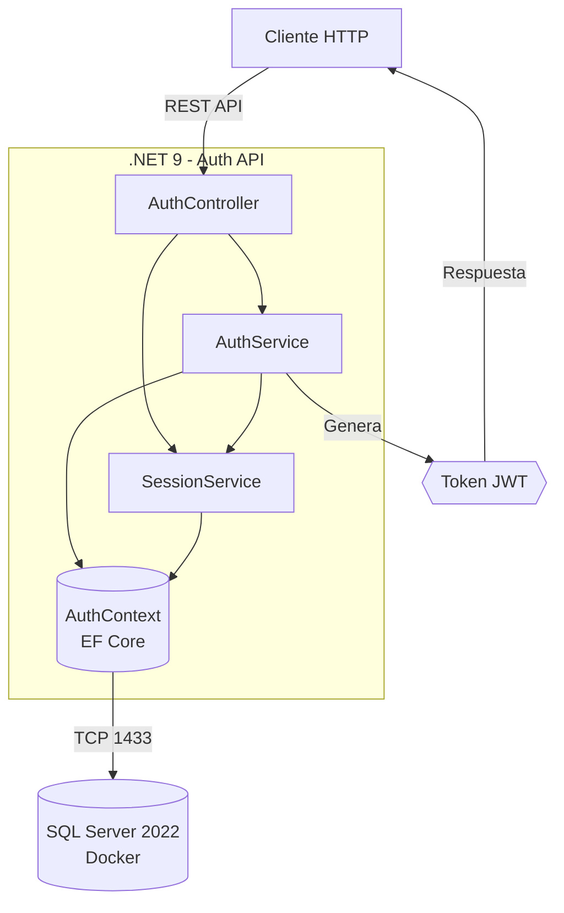
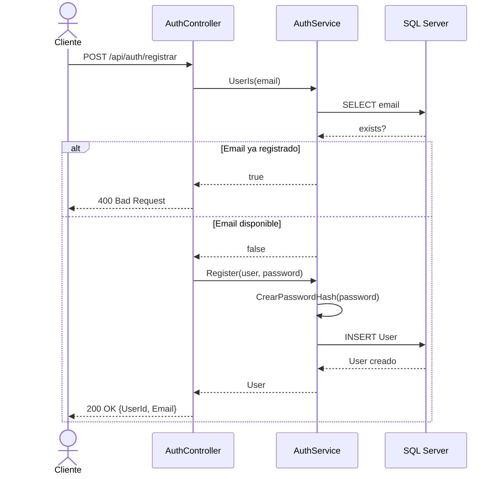
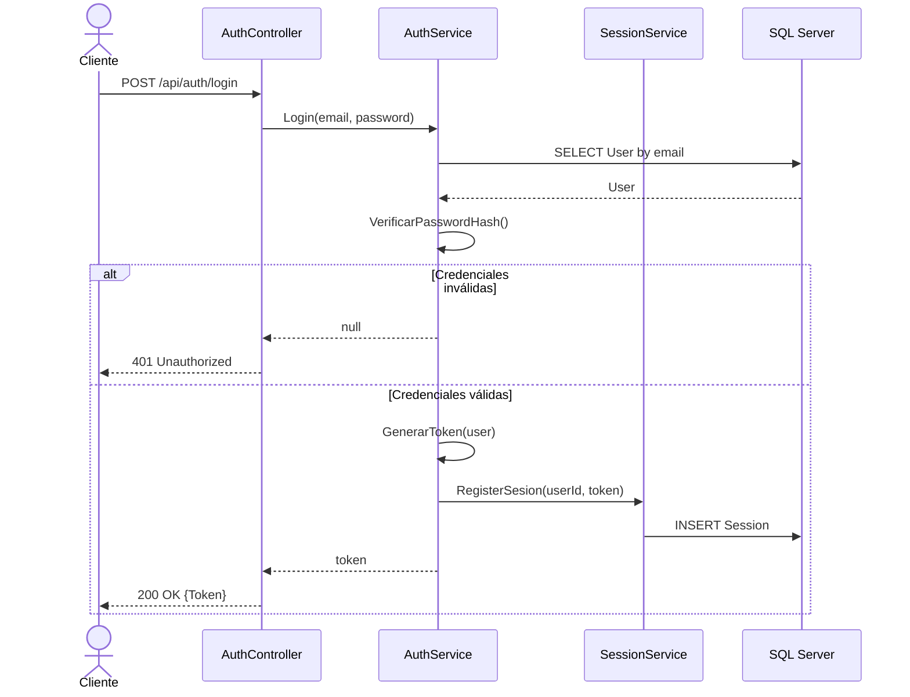
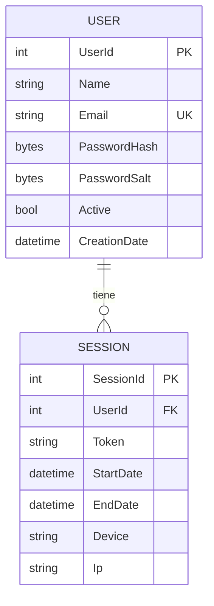

# Auth - Servicio de Autenticación

API REST de autenticación y gestión de sesiones construida con .NET 9, JWT y SQL Server.

## Alcance

Este microservicio cubre:

- **Registro de usuarios** con hash de contraseña (HMACSHA512)
- **Login** con generación de token JWT
- **Gestión de sesiones** (registro, cierre, validación)
- **Migraciones automáticas** de base de datos con EF Core

No cubre: autorización por roles, refresh tokens, recuperación de contraseña, verificación de email.

## Stack Tecnológico

| Componente | Tecnología |
|---|---|
| Runtime | .NET 9 |
| Base de datos | SQL Server 2022 (Docker) |
| ORM | Entity Framework Core 9 |
| Autenticación | JWT Bearer |
| Hashing | HMACSHA512 |

## Arquitectura



## Flujo de Registro



## Flujo de Login



## Modelo de Datos



## Estructura del Proyecto

```
Auth/
├── Controller/
│   └── AuthController.cs      # Endpoints REST + DTOs
├── Data/
│   └── AuthContext.cs          # DbContext EF Core
├── Entity/
│   ├── User.cs                 # Entidad usuario
│   └── Session.cs              # Entidad sesión
├── Service/
│   ├── IAuthService.cs         # Contrato autenticación
│   ├── AuthService.cs          # Lógica de auth + JWT
│   ├── ISessionService.cs      # Contrato sesiones
│   └── SessionService.cs       # Lógica de sesiones
├── Migrations/                 # Migraciones EF Core
├── Program.cs                  # Configuración y startup
├── appsettings.json            # Configuración
└── docker-compose.yml          # SQL Server en Docker
```

## Endpoints

| Método | Ruta | Descripción | Body |
|---|---|---|---|
| POST | `/api/auth/registrar` | Registro de usuario | `{ nombre, email, password }` |
| POST | `/api/auth/login` | Login y obtención de JWT | `{ email, password }` |

## Inicio Rápido

```bash
# 1. Levantar SQL Server
docker compose up -d

# 2. Ejecutar la API (las migraciones se aplican automáticamente)
dotnet run
```

La API estará disponible en `http://localhost:5109`.
